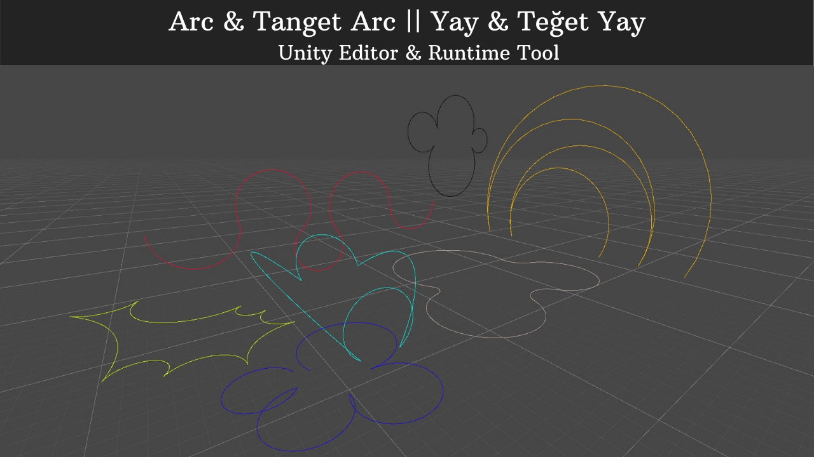

"Yay & Teğet yaylar" oluşturabilmemize yarayan ücretsiz bir Unity Editor&Runtime aracıdır.
Oluşturduğunuz yol boyunca objeleri hareket ettirebilir ve düzenli aralıklarla nesneler oluşturabilirsiniz.
Aracın nasıl kullanıldığına youtube linki üzerinden erişebilirsiniz. 

---------------------------------------------------------------

It is a free Unity Editor & Runtime tool for creating "Arc & Tangent arcs".
You can move objects along the path you created and create objects at regular intervals.
You can access how the tool is used via the youtube link.

Youtube link : https://www.youtube.com/watch?v=QeqSvEMCkW4

